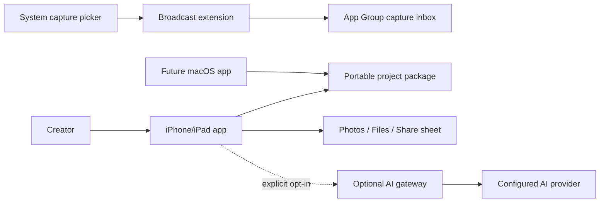
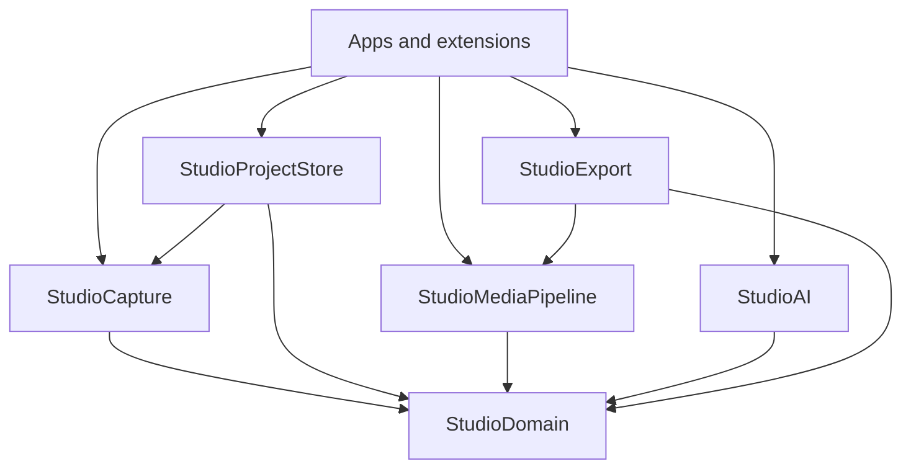
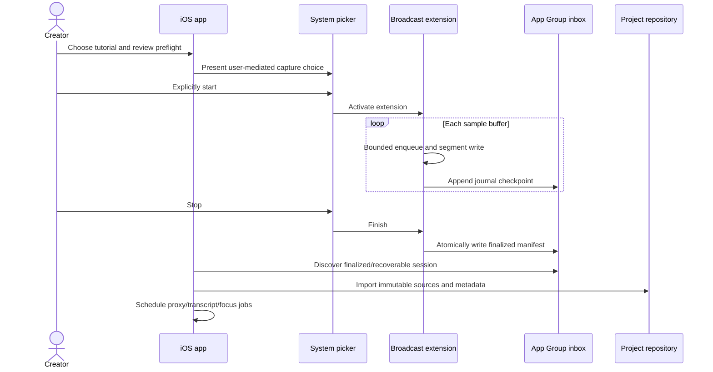
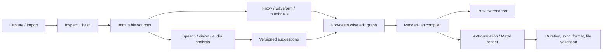

# Architecture

## 1. Context



The project package is the center of the system. Capture frameworks, UI, render engines, and cloud providers are adapters around stable domain contracts.

## 2. Module dependency rule



`StudioDomain` imports Foundation only. It never imports SwiftUI, AVFoundation, ReplayKit, ScreenCaptureKit, database frameworks, or an AI SDK. Platform adapters translate their timestamps and buffers at the boundary.

## 3. Module responsibilities

| Module | Owns | Does not own |
|---|---|---|
| StudioDomain | IDs, portable time/range, projects, assets, tracks, clips, focus/caption/suggestion documents | Files, UI, AVFoundation objects |
| StudioCapture | Capture capability model, session protocol/state/events, artifact manifests | Concrete UI, project edits, AI |
| StudioProjectStore | Package layout, atomic project manifest I/O, migrations, library indexing contract, validated extension inbox import | Rendering and capture callbacks |
| StudioMediaPipeline | Timeline validation, render-plan compilation, responsive geometry, media analysis contracts | UI and cloud calls |
| StudioAI | Transcription/focus/clip protocols, job/suggestion validation, local deterministic heuristics | Provider keys and app consent UI |
| StudioExport | Export profiles, compatibility decisions, render job contract and result validation | Project editing UI |
| iOS app | User intent, permissions/preflight UX, editor/view model, orchestration | Capture/framework internals |
| Broadcast extension | Receive buffers, segment writer, journal/final manifest to App Group | OCR, rendering, remote API, project database |
| macOS app | ScreenCaptureKit adapter, cursor/input adapter, desktop UI | Different project format |
| AI gateway | Authentication, consent claim enforcement, provider secrets, schema validation, minimal proxying | Raw project authority or required core features |

## 4. Capture sequence



The extension cannot rely on the host app running. The inbox is an explicit handoff protocol. The host validates schema, paths, sizes, and hashes before moving assets into a project.

## 5. Project package

```text
My Project.creatorstudio/
  project.json                 identity, schema, settings, asset index
  timeline.json                tracks, clips, focus, captions, annotations
  sources/                     immutable original media
  events/                      capture and interaction JSONL
  analysis/                    transcript and accepted analysis metadata
  presets/                     embedded declarative styles used by project
  cache/                       rebuildable proxies, thumbnails, waveforms
  exports/                     optional outputs retained by user
  journal/                     bounded recovery/edit journal and checkpoints
```

Only `project.json`, `timeline.json`, `sources`, accepted analysis, and referenced presets are authoritative. Cache and exports can be purged. Paths in manifests are relative, normalized, and cannot escape the package.

## 6. Media pipeline



### Focus inference

Candidate signals are normalized into `(timeRange, rect, confidence, reason)`:

1. exact app integration event or macOS click;
2. large localized frame change;
3. newly visible OCR/control-like region;
4. pointer/tap visualization detected in pixels;
5. transcript emphasis or explicit spoken cue;
6. face/subject movement for camera layouts;
7. manual user focus.

Rules merge nearby candidates, reject thrashing, enforce dwell, pad the region, cap zoom/velocity, and avoid captions/facecam. Automatic application uses a high threshold; medium confidence appears as a one-tap suggestion. User edits always win.

### Responsive layout

Scene elements use normalized anchors, content roles, min/max sizes, avoidance zones, and per-output overrides. Switching aspect recomputes the layout and focus crop. It does not copy the timeline. Manual output overrides are sparse patches over shared state.

## 7. Concurrency and state ownership

- `ProjectRepository` actor serializes authoritative manifest changes.
- `CaptureCoordinator` actor serializes capture state but delegates buffer writing to dedicated bounded queues/writers.
- `AnalysisScheduler` actor deduplicates jobs by input hash and applies resource/thermal policy.
- `RenderQueue` actor limits concurrent encoders and coordinates temporary storage.
- UI view models run on `MainActor` and observe immutable snapshots/events; they do not own media resources.
- Cancellation is propagated to analysis/render adapters and produces a durable canceled job state.

## 8. Optional cloud boundary

The client never calls a third-party provider with a production secret. It sends a declared `dataClasses` set plus consent receipt to a gateway. Endpoints are described in [contracts/openapi.yaml](../contracts/openapi.yaml).

Recommended job shapes:

- transcription: audio chunks only when local transcription is unavailable or explicitly overridden;
- chapters/show notes/highlights: transcript and timing metadata by default;
- visual focus/privacy analysis: sampled low-resolution frames only with separate media consent;
- generated edit: JSON suggestions matching the shared schema, never an opaque rendered video.

The optional OpenAI adapter can use the file transcription endpoint for bounded audio and structured outputs for typed suggestions, based on the [official transcription](https://developers.openai.com/api/docs/guides/speech-to-text) and [structured output](https://developers.openai.com/api/docs/guides/structured-outputs) guides. Provider/model selection remains server configuration, not project logic.

## 9. macOS extension path

The macOS app reuses project, timeline, analysis, renderer, presets, and most SwiftUI surfaces. It adds:

- ScreenCaptureKit content picker and display/app/window/audio capture;
- dedicated camera source;
- optional input-monitoring/accessibility adapter for editable pointer/click/keystroke metadata;
- menu bar capture controls, keyboard shortcuts, external displays/storage;
- higher-throughput render profiles and project handoff.

Permission denial degrades gracefully: capture can include the rendered cursor without editable path metadata; keystroke display is disabled. The app never instructs users to bypass macOS privacy controls.

## 10. Key architecture decisions

- [ADR 0001: local-first project package](adr/0001-local-first-project-package.md)
- [ADR 0002: framework-neutral capture boundary](adr/0002-capture-adapters.md)
- [ADR 0003: deterministic edit graph and suggestions](adr/0003-edit-graph-and-suggestions.md)
